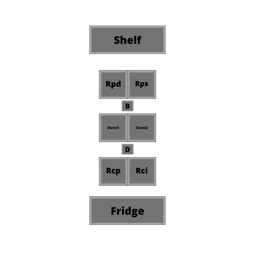

# forza-napoli

## Distribution of elements

Ovens are supposed to be placed one on top of the other, I just needed to represent both on the diagram.
A 3D render of the kitchen would have been nice :)
###Legend
|Acronym|Name|
|---|---|
| D |Work Desk|
| B |Boxes Desk|
|Rcp|Robot Chef Pick|
|Rci|Robot Chef Ingredients|
|Rpd|Robot Prod Delivery|
|Rps|Robot Prod Slice|

##Robots
The robot class is generic. What differentiates robots are the tools attached and the position. 
One can instantiate N robots, always specifying the tool attached to them and its coworker.
###Routes
Routes of each robot will be differentiated based on the tool and the location on the kitchen
< tool >.< position >.robot

|Robot|Route|
|---|---|
|Rcp|pick.chef.robot|
|Rci|ingredients.chef.robot|
|Rpd|delivery.prod.robot|
|Rps|slice.prod.robot|

##Tools
Tools come in all sorts of size and shapes. What it cannot be considered all robots to have attached all tools. 
So, each robot has one tool attached and is the tool the element that determines what kind of routine or 
sequence the robot will perform. This way, when introducing a new tool (we create a new tool in the "tools" folder) 
This way we can easily instantiate a new robot with the new tool attached.
### Ingredients
This tool has one task, to spread the ingredients on the pizza

### Pick
This tool has two sequences, one to pick the pizza from the fridge and another one to place the pizza in the oven

### Delivery
Same to the Pick tool, Delivery has two sequences, one for picking the pizza from the oven and place it in the box, 
and another sequence to close the box and place it in the shelf

### Slicer
The slicer has one sequence, to slice. Is the only robot having fun though...

## Cameras
Cameras have been considered to work as sensors that are capable of triggering signals depending on their detections. 
The object Camera is a simplification of the actual camera element that detects different events. For the sake of this
simulation, cameras will contain boolean signals and a dummy trigger. Not my best simulation but does the job.

### Camera 1: Monitor fridge
Checks for frozen pizza doughs on the fridge.
####Action
- Tells Rcp the position in the freezer where a pizza dough can be found.
- If no pizza dough can be found, camera will tell both Robot Chefs to stop.

### Camera 2: Monitor shelf
Checks for empty spots on the shelf.
####Action
- Tells Rpd the position in the shelf where a pizza can be placed.
- If no place in the shelf is empty, camera will tell Rcp and Rpd to finish their sequence.

### Camera 3-4: Monitor ovens
Checks if pizza is cooked (both cameras have the same functionality).
####Action
- Tells Rpd to pick the pizza from the oven and go to a neutral position.
- If there is no pizza inside the oven, tells Rcp to place a pizza there.

### Camera 5: Monitor pizza boxes
Checks if there is at least one pizza box.
####Action
- If there is a pizza box available, tells Rpd to place the pizza there.
- If there is no pizza box, raises an alarm.

### Camera 6: Monitor quality of ingredients
Checks if the ingredients have been placed correctly on the pizza.
####Action
- If quality is good, tells Rcp to place the pizza in the oven.
- If quality is bad, raises an alarm.

### Camera 7: Monitor quality of slicing
Checks if the slicing have been performed correctly
####Action
- If quality is good, tells Rpd to place the pizza box on the shelf
- If quality is bad, tells Rpi to slice it again.

### Cameras 8, 9 and 10
Save that money! To be honest I cannot think about any other needed monitoring. For sure there is, 
but I cannot imagine right now

## Communication
It has been decided to use RabbitMQ due to the simplicity that offers when it comes to build this kind of prototypes.
The communication between all elements is performed using "topic exchange". Nevertheless, this approach is preferred
due to the easy way of creating the route hierarchy between cameras and robots. At the end of the day, 
this system behaves as if it is implemented using direct exchange

Ref: https://www.rabbitmq.com/tutorials/tutorial-five-python.html

## Questions from the assessment document

- What are the differences between cooking 1 pizza, 2 pizzas, and N pizzas?

Technically, there is no difference between cooking one pizza or infinite. Each tool contains its own sequences and 
is just a matter of handling those sequences start stop and halt.

- What happens if 1 robot fails? What if 2 robots fail?

Handling this kind of situations can be done by cameras while monitoring the quality of the robot's actions or
the same sequence of the robot rising some error.

I believe all the other questions are answered in the above documentation. If there is any question, please do not
hesitate to email me, and I will update this README file properly.

In order to improve even more the solution I would create docker container for each one of the robots and the cameras,
so it is easier to see that it actually works. And also I would have a look at the "tools" folder. There is room for
improvement there.

So far I had fun doing this test, it was very interesting to see how RabbitMQ works, it has a cool GUI also.
